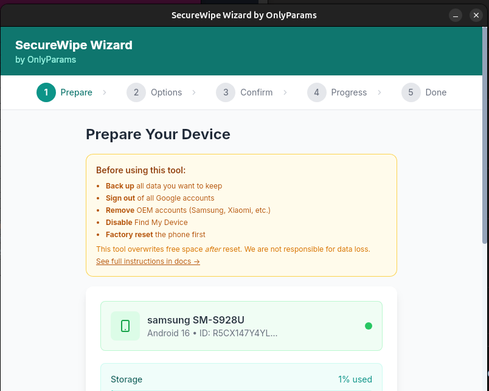

# What Really Happens to Your Trade-In Phone (And Why You Should Wipe It Yourself)

> **Note:** This guide is for **Android devices only**. iOS users benefit from Apple's Secure Enclave - a factory reset properly destroys encryption keys on iPhones. Just remove your accounts first and you're good.

## The Journey After You Hand It Over

When you drop your phone in that trade-in envelope or hand it to a carrier rep, you're trusting a surprisingly complex global supply chain with your digital life. Here's where it actually goes.

### Domestic Triage

Your device first lands at a US processing facility - typically operated by companies like Assurant, Hyla, or Phobio (the behind-the-scenes partners for most carrier and manufacturer programs). There, technicians grade your phone's condition, run diagnostics, and perform their own data wipe.

### The Sorting Hat

Your phone gets graded and routed accordingly:

- **Grade A** (minimal wear): Cleaned up and resold as "Certified Pre-Owned" through domestic channels - Samsung, carriers, Amazon Renewed
- **Grade B** (light damage): Minor refurbishment, then sold through secondary US retailers or exported to Latin America and Eastern Europe
- **Grade C** (significant wear): Shipped overseas for cheaper repair labor - often to facilities in Asia, Africa, or the Middle East

### Where It Gets Interesting

Here's the thing: once your phone leaves that initial US facility, you have zero visibility into who handles it, what tools they use, or what data recovery attempts might occur before the device gets its final wipe.

Is a foreign government systematically scraping intelligence from random American trade-ins? Probably not - the volume makes targeted collection impractical, and modern encryption makes deleted data genuinely difficult to recover. The juice likely isn't worth the squeeze.

*Probably.*

But "probably not" isn't the same as "impossible." And more realistically, you're not just betting against nation-states - you're betting against every underpaid technician, every corner-cutting refurbisher, and every opportunistic data thief in that chain.

---

## The Documented Evidence

This isn't theoretical hand-wringing. Researchers have repeatedly demonstrated how much personal data survives on "wiped" phones.

### University of Hertfordshire / Comparitech Study (2018)

Researchers purchased 100 secondhand phones on eBay and found that **19% still contained data from previous owners**, with 17% having personally identifiable information - including private emails, intimate photos, tax documents, and bank account details.

[Source](https://www.comparitech.com/blog/information-security/personal-data-left-on-mobile-phones/)

### Avast Study (2014)

From just **20 used Android phones** purchased on eBay - all of which had been factory reset - Avast recovered:
- More than **40,000 personal photos**
- Hundreds of emails and text messages
- Over 1,000 Google searches
- A completed loan application
- The identities of four previous owners

**How they did it:** Using standard forensic tools - FTK Imager for disk imaging, `dd` for raw disk cloning, and Scalpel for data carving - researchers extracted data from "unallocated space" that standard deletion doesn't touch. They recovered Facebook chat logs, GPS coordinates, and intimate photos that previous owners assumed were gone.

[Source: How Avast recovered 'erased' data from used Android phones](https://blog.avast.com/2014/07/09/android-foreniscs-pt-2-how-we-recovered-erased-data/)

---

## The Threats That Actually Keep Security Pros Up at Night

Forget the spy movie scenarios for a moment. The real risks are mundane:

- **Lazy consumer wipes** - A basic factory reset without removing accounts first can leave recovery breadcrumbs
- **Cached credentials** - Banking apps, email clients, and authenticators can leave fragments behind
- **Cloud account links** - A phone still tied to your Google account remains a liability
- **Personal content** - Photos, messages, and documents that weren't properly encrypted to begin with

These aren't theoretical. The studies above found everything from intimate photos to tax returns to text messages containing sensitive personal details - all on devices the previous owners believed were clean.

---

## What You Should Actually Do

Before any trade-in, take control of your device's data yourself. Don't trust the carrier. Don't trust the processing facility. Don't trust the pawn shop employee who "definitely wiped it."

### The Basic Protocol

1. **Remove all accounts** - Google, Samsung, everything. Do this *before* the factory reset to avoid Factory Reset Protection locks
2. **Factory reset from settings** - On modern Android (6.0+), this destroys your encryption keys, making data cryptographically unrecoverable under normal circumstances

### The Belt-and-Suspenders Approach

For the security-conscious (or the reasonably paranoid), go further:

After factory reset, use ADB to **overwrite free space with random data** multiple times. This addresses edge cases like wear leveling on flash storage and ensures that even theoretical data remnants are thoroughly scrambled.

**That's what this repo provides** - ready-to-run scripts that handle the secure overwrite for you.

---

## The Bottom Line

You can't control where your trade-in ends up. You can't verify who touches it or what tools they have. What you *can* control is the state of that device when it leaves your hands.

Take the extra time. Wipe it properly. Because "probably fine" is a lousy security policy.

---

# Secure Android Phone Wipe Guide

A complete guide to securely wiping an Android phone before trade-in, sale, or disposal. This guide uses ADB (Android Debug Bridge) to overwrite storage with random data multiple times after a factory reset.

## Quick Start (TL;DR)

If you're comfortable with terminal commands, here's the short version:

```bash
# 1. Install ADB (pick your OS)
sudo apt install adb                          # Linux
brew install android-platform-tools           # macOS
# Windows: Download from developer.android.com/studio/releases/platform-tools

# 2. On your phone: Remove all accounts, then factory reset

# 3. After reset: Enable Developer Options (tap Build Number 7 times)
#    Then enable USB Debugging in Developer Options

# 4. Connect phone via USB, authorize the connection on phone

# 5. Clone this repo and run the script
git clone https://github.com/OnlyParams/android-secure-wipe.git
cd android-secure-wipe
./scripts/quick_wipe.sh

# 6. Do another factory reset, then you're done!
```

**New to this?** Read the full guide below - it explains each step in detail.

---

## Why This Matters

A standard factory reset marks data as deleted but doesn't actually overwrite it. With forensic tools, deleted data can potentially be recovered. This guide ensures your personal data is thoroughly scrambled beyond recovery.

**Note:** Modern Android phones (6.0+) encrypt user data by default. A factory reset destroys the encryption keys, making data recovery extremely difficult. The overwrite steps in this guide provide additional insurance for the security-conscious.

---

## Prerequisites

### Requirements

- [Android Debug Bridge (ADB)](https://developer.android.com/tools/adb) - Part of the [Android SDK Platform Tools](https://developer.android.com/studio/releases/platform-tools), open-sourced by Google under the Apache 2.0 License

### On Your Computer

**Linux (Ubuntu/Debian):**
```bash
sudo apt install adb
```

**macOS:**
```bash
brew install android-platform-tools
```

**Windows:**
1. Download [Android SDK Platform Tools](https://developer.android.com/studio/releases/platform-tools)
2. Extract to a folder (e.g., `C:\platform-tools`)
3. Add to PATH or run commands from that folder

### Verify Installation
```bash
adb version
```

---

## Phase 1: Backup Your Data

### Option A: Samsung Smart Switch (Recommended for Samsung)

1. Install [Smart Switch](https://www.samsung.com/us/support/owners/app/smart-switch) on your computer
2. Connect phone via USB
3. Open Smart Switch -> Click "Backup"
4. Select all data categories you want to preserve
5. Wait for backup to complete

### Option B: Google Backup

1. **Settings -> Google -> Backup**
2. Ensure "Back up to Google Drive" is ON
3. Tap "Back up now"
4. Verify backup completed in Google Drive

### Option C: Manual Backup via ADB

```bash
# Full backup (apps + data)
adb backup -apk -shared -all -f phone_backup.ab

# Just pull specific folders
adb pull /sdcard/DCIM ./backup/photos
adb pull /sdcard/Download ./backup/downloads
adb pull /sdcard/Documents ./backup/documents
```

### Don't Forget

- [ ] Photos and videos synced to cloud or computer
- [ ] Contacts synced to Google account
- [ ] WhatsApp/Signal/Telegram backups
- [ ] Authenticator apps (export codes or transfer to new device FIRST)
- [ ] Notes and documents
- [ ] Downloaded files
- [ ] Game save data (check if cloud-synced)

---

## Phase 2: Sign Out of Accounts

> **Why this matters:** If you factory reset without removing your Google account first, the phone will be locked with "Factory Reset Protection" (FRP). This means whoever receives the phone won't be able to use it without your Google password - and you won't be able to prove it's not stolen. **Always remove accounts BEFORE the factory reset.**

**Step by step:**

1. Go to **Settings -> Accounts**
2. Tap each account and select **"Remove account"**
3. Remove your Google account **last** (some apps won't let you remove them without a Google account present)
4. After all accounts are removed, go to **Settings -> General Management -> Reset**
5. Before tapping reset, verify it shows "No accounts" or you see no accounts listed

### Samsung Phones - Extra Steps

Samsung phones have their own account system that also enables device lock:

1. **Settings -> Accounts -> Samsung account -> Sign out**
2. **Settings -> Biometrics and security -> Find My Mobile -> Turn OFF**

If you skip these steps, Samsung's "Find My Mobile" can still lock the device remotely.

---

## Phase 3: Factory Reset

### From Settings (Preferred)
1. **Settings -> General Management -> Reset**
2. Tap **Factory data reset**
3. Scroll down, tap **Reset**
4. Enter PIN/password if prompted
5. Tap **Delete all**

### From Recovery Mode (If needed)
1. Power off phone
2. Hold **Volume Up + Power** until logo appears
3. Use volume buttons to select "Wipe data/factory reset"
4. Press Power to confirm
5. Select "Yes" to confirm
6. Select "Reboot system now"

---

## Phase 4: Enable USB Debugging

After factory reset, go through minimal setup:

1. **Skip everything** - tap "Skip", "Not now", "Set up later" for:
   - Wi-Fi (can skip or connect temporarily)
   - Google account
   - Samsung account
   - All optional features

2. **Enable Developer Options:**
   - **Settings -> About Phone**
   - Tap **Build Number** 7 times rapidly
   - Enter PIN if prompted
   - "Developer mode enabled" will appear

3. **Enable USB Debugging:**
   - **Settings -> Developer Options**
   - Scroll to **USB Debugging** -> Toggle ON
   - Confirm the warning prompt

4. **Connect to Computer:**
   - Connect USB cable
   - Change USB mode to "File Transfer" if prompted
   - Look for authorization popup on phone
   - Check "Always allow from this computer"
   - Tap **Allow**

5. **Verify Connection:**
   ```bash
   adb devices
   ```
   Should show your device with "device" status (not "unauthorized")

---

## Phase 5: Secure Overwrite

### Quick Wipe (~15 minutes)

Use `scripts/quick_wipe.sh` for most trade-in scenarios - 3 passes of 1GB random data:

```bash
./scripts/quick_wipe.sh
```

### Full Wipe (1-2+ hours)

Use `scripts/full_wipe.sh` for maximum security - fills entire storage multiple times:

```bash
# Foreground
./scripts/full_wipe.sh

# Background (for long wipes)
nohup ./scripts/full_wipe.sh > wipe_output.log 2>&1 &

# Monitor progress
tail -f phone_wipe.log
```

---

## Phase 6: Final Steps

1. **Disconnect phone from computer**

2. **Perform another factory reset** (optional but recommended):
   - Settings -> General Management -> Reset -> Factory data reset
   - This cleans up any artifacts from the wipe process

3. **Power off the phone**

4. **Remove SIM card and SD card** (if present)

5. **Phone is ready for trade-in/sale**

---

## Troubleshooting

### "unauthorized" in adb devices

This means your phone sees the computer but hasn't trusted it yet.

**Fix:**
1. Look at your phone screen - there should be a popup asking "Allow USB debugging?"
2. Check the box that says "Always allow from this computer"
3. Tap **Allow**

**If no popup appears:**
1. Go to Settings -> Developer Options
2. Tap "Revoke USB debugging authorizations"
3. Unplug and replug the USB cable
4. The popup should now appear

### "device not found" or "no devices"

This means your computer can't see the phone at all.

**Checklist:**
1. **Try a different USB cable** - Many cables are "charge only" and don't transfer data. Use the cable that came with your phone if possible.
2. **Try a different USB port** - Front panel ports sometimes have issues. Try a port directly on the back of your computer.
3. **Check the USB mode on your phone** - Pull down the notification shade and look for "USB charging this device". Tap it and select "File Transfer" or "MTP".
4. **Restart the ADB server** - Run: `adb kill-server && adb start-server`

### "Permission denied" errors

The scripts write to `/sdcard/` which should always be writable without root access.

**If you see this error:**
1. Make sure you completed the factory reset before running the script
2. Try disconnecting and reconnecting the phone
3. Restart ADB: `adb kill-server && adb start-server`

**Note:** Some guides suggest using `run-as` commands - this won't help here because `run-as` only works for app debugging, not storage access.

### Write speed is slow

This is normal - writing random data to flash storage takes time.

**Tips to speed things up:**
- Use a USB 3.0 port (usually blue inside) instead of USB 2.0
- Use a high-quality USB cable
- Use `quick_wipe.sh` with `--size 512` for faster passes
- Keep the phone unlocked and screen on during the wipe

### Phone disconnects during wipe

**Prevent disconnections:**
1. Disable auto-sleep: Settings -> Display -> Screen timeout -> Set to 10 minutes or "Never"
2. Keep the phone unlocked during the entire wipe
3. Don't move the phone or cable during the wipe
4. Make sure the USB cable is firmly connected at both ends

---

## Security Notes

- **Encryption:** Android 6.0+ encrypts user data by default. Factory reset destroys encryption keys, making data recovery very difficult even without overwriting.

- **Wear Leveling:** Flash storage uses wear leveling, which may leave data fragments in reserved blocks. Multiple overwrite passes help address this.

- **Secure Erase:** Some phones support hardware-level secure erase via fastboot. Check your device documentation.

- **For Highly Sensitive Data:** Physical destruction is the only 100% guarantee. For most personal use, this guide provides excellent protection.

---

## Desktop App (SecureWipe Wizard)

SecureWipe Wizard is a free, open-source desktop tool for securely wiping Android devices.
**Important**: This tool overwrites free space with random data. It is intended to be used **after** a factory reset for maximum security. We are **not responsible** for any data loss, device issues, or unintended consequences.



### Download

Download the latest version from GitHub Releases:
https://github.com/OnlyParams/android-secure-wipe/releases

Choose the installer for your operating system:
- **Windows**: `.msi` installer — double-click to install
- **macOS**: `.dmg` — open and drag to Applications folder
- **Linux**:
  - `.deb` — for Ubuntu/Debian (`sudo dpkg -i securewipe-wizard_*.deb`)
  - `.rpm` — for Fedora/RHEL (`sudo rpm -i securewipe-wizard-*.rpm`)
  - `.AppImage` — make executable and run (`chmod +x SecureWipe*.AppImage && ./SecureWipe*.AppImage`)

### Desktop App Prerequisites

1. **Install ADB** (Android Debug Bridge):
   - **Linux**: `sudo apt install adb`
   - **Windows**: Download Platform-Tools from https://developer.android.com/tools/releases/platform-tools
   - **macOS**: `brew install android-platform-tools`

2. **On your Android device**:
   - Enable **Developer Options** (Settings → About phone → tap Build number 7 times)
   - Enable **USB Debugging** (Developer Options)
   - Use a **data-capable USB cable** (not charge-only)

### Usage — Step by Step

1. **Launch SecureWipe Wizard**
2. **Connect your Android phone via USB**
3. **Step 1: Prepare**
   - Click "Check Connection"
   - Device model and storage info should appear
   - Ensure the correct device is shown

4. **Step 2: Options**
   - Choose mode:
     - **Quick Wipe** (~15–30 minutes): 3 passes × 1GB chunks — recommended for most users
     - **Full Wipe** (1–3+ hours): 3 passes across ~95% of free space — maximum thoroughness
   - Adjust passes if desired (1–10)

5. **Step 3: Confirm**
   - Review settings
   - Click **Start Wipe**

6. **Step 4: Progress**
   - Watch real-time progress
   - You can **Abort** at any time (temporary files will be cleaned)

7. **Step 5: Done**
   - Follow on-screen checklist:
     - Perform a **factory reset** (Settings → General management → Reset)
     - Verify no data remains (optional recovery tool test)
     - Remove SIM/SD cards
     - Power off device

### Safety Notes

- **Always backup important data first** — this tool is irreversible
- **Sign out of all accounts** (Google, Samsung, etc.) before wiping
- **Disable Find My Device / FRP** if possible
- **Samsung devices**: Some storage reporting quirks are handled automatically
- **Multiple devices**: The app will error if more than one is connected — unplug others

### Known Limitations

- No auto-updates yet (check GitHub for new versions)
- Unsigned binaries may trigger Gatekeeper (macOS) or SmartScreen (Windows) warnings — click "More info" → "Run anyway"
- Tested primarily on Samsung Galaxy S24 — works on most Android 10+ devices

### Build from Source

```bash
cd desktop-app
npm install
npm run tauri dev    # Development mode
npm run tauri build  # Production build
```

**Requirements:** Node.js 20+, Rust 1.70+, ADB installed

Built with [Tauri](https://tauri.app) + Svelte. Branded: **OnlyParams, a division of Ciphracore Systems LLC**.

---

## Contributing

Found an issue or have a suggestion? Open an issue or submit a PR.

## Credits

This project was built collaboratively by:
- **McJuniorstein** — Project lead, testing, and direction
- **Claude Opus 4.5** (Anthropic) — Architecture, Rust/Tauri implementation, and documentation
- **Grok 4.1** (xAI) — Research and planning contributions

## License

MIT License - See [LICENSE](LICENSE) for details.

---

*Created by [OnlyParams](https://onlyparams.dev), a division of Ciphracore Systems LLC - Practical security for the reasonably paranoid.*
